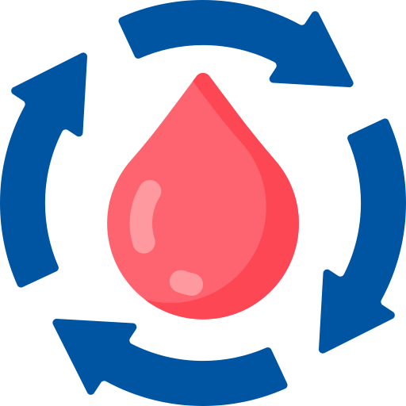

<div align="center">
  
  <h1>BloodSync Life</h1>
  <p>A comprehensive blood donation management system designed to streamline the process of blood donation and distribution.</p>
  
  [](https://choosealicense.com/licenses/mit/)
  [](https://www.oracle.com/java/)
  [](https://spring.io/projects/spring-boot)
  [](https://reactjs.org/)
  [](https://www.typescriptlang.org/)
</div>

---

## 📋 Table of Contents
- [Features](#features)
- [Tech Stack](#tech-stack)
- [Getting Started](#getting-started)
  - [Frontend Setup](#frontend-setup)
  - [Backend Setup](#backend-setup)
- [Environment Configuration](#environment-configuration)
- [Database Setup](#database-setup)
- [API Documentation](#api-documentation)
- [Testing](#testing)
- [Contributing](#contributing)
- [License](#license)
- [Contact](#contact)

## ✨ Features

- **User-Friendly Interface**: Intuitive UI for both donors and administrators.
- **Real-Time Blood Inventory Management**: Monitor and update blood stock in real-time.
- **Appointment Scheduling**: Easily schedule and manage blood donation appointments.
- **Donor Eligibility Screening**: Integrated screening process to ensure donor eligibility.
- **Blood Request Management**: Allow hospitals to request specific blood types.
- **Analytics and Reporting Dashboard**: Comprehensive data visualization for better insights.

## 🛠️ Tech Stack

### Frontend
- **React.js** with **TypeScript**
- **Tailwind CSS** for styling
- **React Router** for seamless navigation
- **Axios** for handling API requests

### Backend
- **Java 11+** with **Spring Boot**
- **Gradle** for build automation
- **JPA** for database operations
- **RESTful API** design for frontend-backend communication

---

## 🚀 Getting Started

### Prerequisites
Ensure you have the following software installed:
- **Node.js** (v14 or later)
- **Java Development Kit (JDK)** 11 or later
- **Gradle**

### Frontend Setup
1. **Clone the Repository**:
   ```bash
   git clone https://github.com/brighteyekid/BloodSync.git
   ```
2. **Navigate to the Project Directory**:
   ```bash
   cd BloodSync/frontend
   ```
3. **Install Dependencies**:
   ```bash
   npm install
   ```
4. **Start the Development Server**:
   ```bash
   npm start
   ```
   The application will be accessible at `http://localhost:3000`.

### Backend Setup
1. **Navigate to the Backend Directory**:
   ```bash
   cd backend
   ```
2. **Build the Project**:
   ```bash
   gradle build
   ```
3. **Run the Application**:
   ```bash
   gradle bootRun
   ```
   The backend server will start on `http://localhost:8080`.

---

## 🔧 Environment Configuration

### Frontend Configuration
In the `frontend` directory, create a `.env` file with the following variables:
```env
REACT_APP_API_URL=http://localhost:8080
```

### Backend Configuration
In the `backend` directory, create an `application.properties` file with the following settings:
```properties
# Server Configuration
server.port=8080

# Database Configuration
spring.datasource.url=jdbc:postgresql://localhost:5432/bloodsync_db
spring.datasource.username=your_db_username
spring.datasource.password=your_db_password
```

---

## 📦 Database Setup

1. **Create the Database**:
   - Open your PostgreSQL client and run:
     ```sql
     CREATE DATABASE bloodsync_db;
     ```
2. **Run Migrations**:
   - The application will automatically apply necessary database migrations at startup.
   - Alternatively, you can run migrations manually if using Flyway or Liquibase.

---

## 📜 API Documentation

- The API documentation is generated with **Swagger** and accessible at `http://localhost:8080/swagger-ui.html` when the backend server is running.
- Detailed documentation of all API endpoints, including parameters, request/response structures, and examples, can be found here.

---

## 🧪 Testing

### Frontend Testing
Run tests for the frontend using:
```bash
npm test
```

### Backend Testing
Run tests for the backend using Gradle:
```bash
gradle test
```

### Test Coverage
- Ensure you write tests for each component and endpoint to maintain code quality.
- For backend tests, use JUnit and Mockito.
- For frontend, leverage Jest and React Testing Library.

---

## 🤝 Contributing

We welcome contributions to **BloodSync Life**! Please follow these steps to contribute:

1. **Fork the Repository**.
2. **Create a Feature Branch**:
   ```bash
   git checkout -b feature/your-feature-name
   ```
3. **Commit Your Changes**:
   ```bash
   git commit -m 'Add new feature: Your feature description'
   ```
4. **Push to the Branch**:
   ```bash
   git push origin feature/your-feature-name
   ```
5. **Open a Pull Request** for review.

### Coding Standards
- Follow Java and JavaScript/TypeScript best practices.
- Use meaningful commit messages.
- Maintain code readability and consistency.

---

## 📄 License

This project is licensed under the MIT License. See the [LICENSE](LICENSE) file for details.

---

## 📞 Contact

For any questions or support, please reach out to:
- **Email**: [cb2117@srmist.edu.in](mailto:cb2117@srmist.edu.in)
  
Project Link: [https://github.com/brighteyekid/BloodSync](https://github.com/brighteyekid/BloodSync)

---

<div align="center">
  Made with ❤️ by <a href="https://github.com/brighteyekid">brighteyekid</a>
</div>
```
